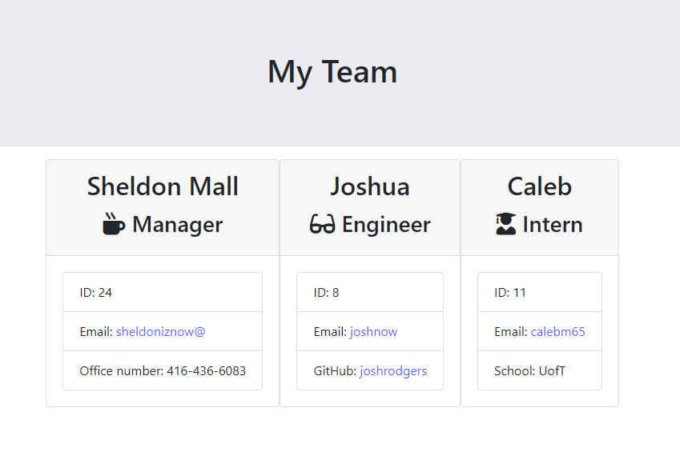
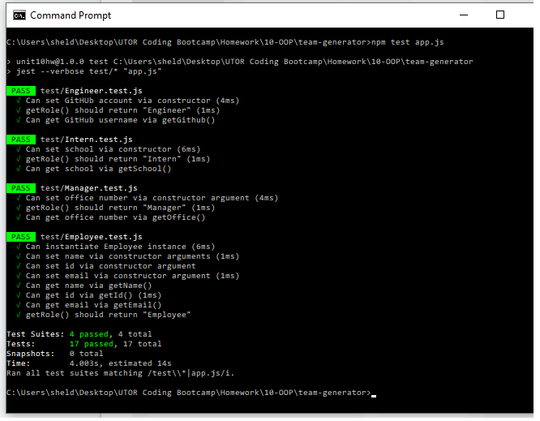

# This is unit 10 OOP: Team Generator Application

## Application URL

My code can be found at [Team Generator](https://sheldonmall.github.io/team-generator/) 

## Description

This is a CLI application that accepts employees information and then generates a displayable HTML file at the end which contains the team information.

## Installation

* Please run `npm install` to install the dependancies (inquirer and jest) before you execute this application.

## Usage 

Execute the application by giving the following command on the command line:
`$node app.js`

* The application will first prompt the **Manager** to enter his/her *name, ID, email* and *office number* information.

- After the **Manager** information has been entered, the application then proceeds to ask the information for **Team Members**.

- There are two types of team members-**Engineers** and **Interns**.

- Based on the type of team member to be entered, the application prompts for role specific information.

- After each team member information has been entered, the application asks if the Manager wants to enter information for more team members. If the Manager wants to enter more team members, the applications loops back to accept more team members.

- When the Manager does not want to enter more team members, the application then saves the team details in an HTML format that can be viewed in a browser.

My Task list for developing this application are as follows:

[x] Building the application

[x] Running Tests 

[X] Fully functional

[ ] User testing

[ ] User feedback 

## Credits

I have made extensive use of NPM website to check usage and syntax of commands. I sought help from my tutor to understand and approach this homework. 

## Contributing

I invite and would welcome contributions and ideas. Please contribute to the application at https://github.com/sheldonmall/

## License

There is no need for any license at the moment to use my application.

---

## Tests

The applications is fully functional. Please test it for different roles and options.
